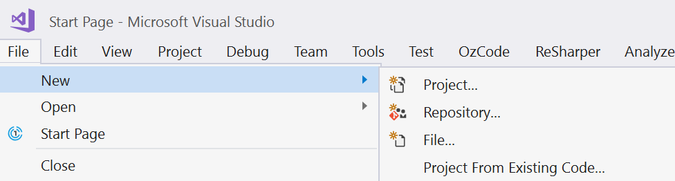
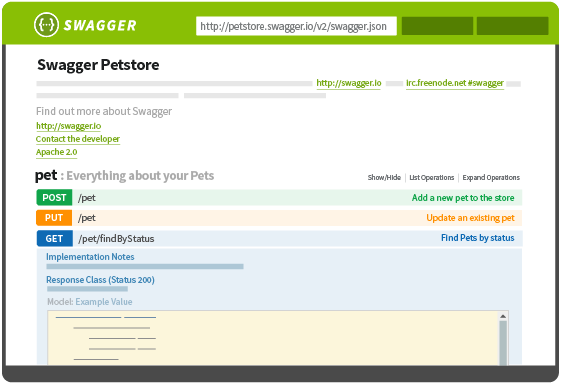

#### Versioning and Maintaining Your REST API

#### Using <span class="orange">ASP.NET Core</span>

@schneidenbach

---

Twitter <span class="orange">@schneidenbach</span>

## Slides plus more at

<span class="blue">rest.schneids.net</span>

---

## You have a SaaS product

---

## You make widgets

---

## You do accounting

---


---

# Integration

---


---

# REST API

---



---

## Endpoint structure?

---

## Documentation?

---


"Update existing REST API"

---

## Extending Endpoints?

---

## Changing existing behaviors?

---


---

## Versioning and Maintaining

---

# Versioning

---

## <span class="orange">"Typical" REST URLs</span>

GET `api/Jobs`  
GET `api/Jobs/12345`  
PUT `api/Jobs/12345`  
POST `api/Jobs`

---

## <span class="orange">"Typical" REST URLs</span>

GET `api/Jobs`  
GET `api/Jobs/12345`  
PUT `api/Jobs/12345`  
POST `api/Jobs` <-- NEEDS TO CHANGE?

---

## Versioning to the rescue

---

#### <span class="orange">Lots of different version options</span>

URL versioning  
Header versioning  
Content type versioning

---

## <span class="orange">Version formats</span>

* /api/foo?api-version=1.0
* /api/foo?api-version=2.0-Alpha
* /api/foo?api-version=2015-05-01.3.0
* /api/v1/foo
* /api/v2.0-Alpha/foo
* /api/v2015-05-01.3.0/foo

https://github.com/Microsoft/aspnet-api-versioning/wiki/Version-Format

---

Truth is, you (probably) <span class="orange">don't need 'em</span>

---

# v1
# v2

---

Adding to your project?

---

## Nuget

Microsoft.AspNetCore.Mvc.Versioning

---

```csharp
public void ConfigureServices(IServiceCollection services)
{
    services.AddMvc();
    services.AddApiVersioning();
}
```

---

```csharp
namespace ConstructionApp.Jobs.V1
{
  [ApiVersion("1.0")]
  [Produces("application/json")]
  [Route("api/jobs")]
  public class JobsController : Controller {}
}

namespace ConstructionApp.Jobs.V2
{
  [ApiVersion("2.0")]
  [Produces("application/json")]
  [Route("api/jobs")]
  public class JobsController : Controller {}
}
```

---

## <span class="orange">Header</span> versioning

---

```csharp
services.AddApiVersioning(o =>
{
    o.ApiVersionReader = new HeaderApiVersionReader("X-Api-Version");
});
```

URL: `/api/Jobs`  
Header: `X-Api-Version: 2.0`

---

## <span class="orange">Query string</span> versioning

---

```csharp
services.AddApiVersioning(o =>
{
    o.ApiVersionReader = new QueryStringApiVersionReader("version");
});
```

URL: `/api/Jobs?version=2.0`

---

## <span class="orange">Route</span> versioning

---

## <span class="orange">Route</span> versioning

(Spencer's personal favorite)

---

```csharp
services.AddApiVersioning(o =>
{
    o.ApiVersionReader = new UrlSegmentApiVersionReader();
});
```

```csharp
namespace ConstructionApp.Jobs.V1
{
  [ApiVersion("1.0")]
  [Produces("application/json")]
  [Route("api/v{version:apiVersion}/jobs")]
  public class JobsController : Controller {}
}
```

---

```csharp
services.AddApiVersioning(o =>
{
    o.ApiVersionReader = new UrlSegmentApiVersionReader();
});
```

URL: `/api/v2.0/Jobs`

---

## <span class="orange">Media type</span> versioning

---

```csharp
services.AddApiVersioning(o =>
{
    o.ApiVersionReader = new MediaTypeApiVersionReader();
});
```

URL: `/api/Jobs`  
Method: `GET`  
Header: `Accept: application/json;v=1.0`

---

```csharp
services.AddApiVersioning(o =>
{
    o.ApiVersionReader = new MediaTypeApiVersionReader();
});
```

URL: `/api/Jobs`  
Method: `POST`  
Header: `Content-Type: application/json;v=1.0`

---

## Versions are <span class="orange">composable</span>

---

```csharp
services.AddApiVersioning(o =>
{
    o.ApiVersionReader = ApiVersionReader.Combine(
        new QueryStringApiVersionReader(),
        new HeaderApiVersionReader
        {
            HeaderNames = {"api-version"}
        });
});
```

---

Adding versions to <span class="orange">existing APIs</span>?

---

```csharp
services.AddApiVersioning(o =>
{
    o.AssumeDefaultVersionWhenUnspecified = true;
    //default version is 1.0
});
```

Add to a brownfield project


---

```csharp
namespace ConstructionApp.Jobs.V1
{
  [ApiVersionNeutral]
  [Produces("application/json")]
  [Route("api/jobs")]
  public class JobsController : Controller {}
}
```

Add to a brownfield project

---

```csharp
namespace ConstructionApp.Jobs.V1
{
  [ApiVersion("1.0")]   //this becomes optional
  [Produces("application/json")]
  [Route("api/jobs")]
  public class JobsController : Controller {}
}
```

`GET` /api/jobs

---

```csharp
namespace ConstructionApp.Jobs.V1
{
  [Produces("application/json")]
  [Route("api/jobs")]
  public class JobsController : Controller {}
}
```

`GET` /api/jobs?version=1.0 HTTP/1.1

---

## Different default version?

---

```csharp
services.AddApiVersioning(o =>
{
    o.AssumeDefaultVersionWhenUnspecified = true;
    o.DefaultApiVersion = new ApiVersion( new DateTime( 2018, 7, 1 ) );
});
```

---

# Swagger?

---



---

# Swagger?

https://github.com/Microsoft/aspnet-api-versioning/wiki/Swashbuckle-Integration

---

## The <span class="orange">real question</span>

---

## Do you <span class="orange">need</span> this?

---

```csharp
namespace ConstructionApp.Jobs.V1
{
  [Produces("application/json")]
  [Route("api/v1/jobs")]
  public class JobsController : Controller {}
}

namespace ConstructionApp.Jobs.V2
{
  [Produces("application/json")]
  [Route("api/v2/jobs")]
  public class JobsController : Controller {}
}
```

---

Simple/easy to understand

---

Lesson: Introduce as much complexity as you need

---


---

## Takeaways

ALWAYS version up front when possible

---

## Takeaways

Versioning most common in URL

---

## Takeaways

Keep it simple when possible

---

## Takeaways

Document Document Document

---

### Lots more info

https://github.com/Microsoft/aspnet-api-versioning/wiki

---

## Version strategy chosen

---


---

## How to maintain?

---

Application lifecycle question

---


---


---

# <span class="orange">RULE</span>

Don't break contracts. Ever.

---

URL: `/api/v2.0/Jobs`  

```json
{
    "name": "Building a Wal-Mart",
    "code": "12345-67",
    "address": "123 Main Street"
}
```

---

URL: `/api/v2.0/Jobs`  

```json
{
    "name": "Building a Wal-Mart",
    "code": "12345-67"
}
```

---

URL: `/api/v2.0/Jobs`  

```json
{
    "name": "Office buildout",
    "code": "12345-67",
    "address": "123 Main Street",
    "address2": "Suite 17"
}
```

---

# <span class="orange">RULE</span>

Don't break contracts. Ever.

---

# <span class="orange">RULE</span>

Don't break contracts. Ever.  

...is ideal

---

# <span class="orange">RULE</span>

Don't break contracts. Ever.  

...is just not practical

---

Who/What/Where/When/Why/How

---

# Why?

---

# Why?

```json
{
    "name": "Office buildout",
    "code": "12345-67",
    "address": "123 Main Street",
    "address2": "Suite 17"
}
```

---

# Who?

...is your consumer?  
* Internal?
* External (integration)?

---

# What?

...needs changing?

---

# How?

...urgent is it?

---

# Where?

...are you in development?

---


---

### <span class="orange">Timeline</span>

* March 2018 - POC completed
* May 2018 - First draft complete
* June 2018 - Final draft complete
* July 2018 - API made public

---

# When?

---

# When?

Hotfix? End of sprint?

---

### What is your <span class="orange">versioning strategy</span>?

---

## Versions are a balancing act

---

## Version 2.0

```json
{
    "name": "Office buildout",
    "code": "12345-67",
    "address": "123 Main Street",
    "address2": "Suite 17"
}
```

---

## Version 3.0

```json
{
    "name": "Office buildout",
    "code": "12345-67",
    "address": "123 Main Street",
    "address2": "Suite 17",
    "city": "Kirkwood"
}
```

---

## Version 56.0

```javascript
{
    "name": "Office buildout",
    "code": "12345-67",
    "address": "123 Main Street",
    "address2": "Suite 17",
    "city": "Kirkwood",
    /* ...100 more properties... */
}
```

---


---

### Deprecation is a good strategy

---

```csharp
namespace ConstructionApp.Jobs.V1
{
  [ApiVersion( "1.0", Deprecated = true )]
  [Produces("application/json")]
  [Route("api/v1/jobs")]
  public class JobsController : Controller {}
}
```

---

```csharp
namespace ConstructionApp.Jobs.V1
{
  [ApiVersion( "1.0", Deprecated = true )]
  [Produces("application/json")]
  [Route("api/v1/jobs")]
  public class JobsController : Controller {}
}
```

#### Response includes:  
`api-deprecated-versions: 1.0`

---

## <span class="orange">Documentation</span> way more useful

---

### Change management is <span class="orange">HARD</span>

---


---

```csharp
namespace ConstructionApp.Jobs.V1
{
  [ApiVersion( "1.0", Deprecated = true )]
  [ApiVersion( "2.0")]
  [Produces("application/json")]
  [Route("api/v1/jobs")]
  public class JobsController : Controller
  {
    [HttpGet]
    public string Get() => "Hello world!"

    [HttpGet, MapToApiVersion( "2.0" )]
    public string GetV2() => "Hello world v2.0!";
  }
}
```

---


---

## <span class="orange">Takeaways</span>

Break published APIs minimally

---

## <span class="orange">Takeaways</span>

Remember app lifecycle

---

## <span class="orange">Takeaways</span>

Fix bugs, but... break minimally

---

## <span class="orange">Did I Mention?</span>

Break published APIs minimally

---


---

Versioning > Breaking Changes

---

### More resources

rest.schneids.net

---

## Thank you!

[@schneidenbach](https://twitter.com/schneidenbach)  
schneids.net
